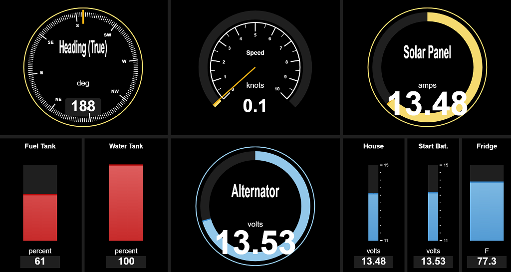
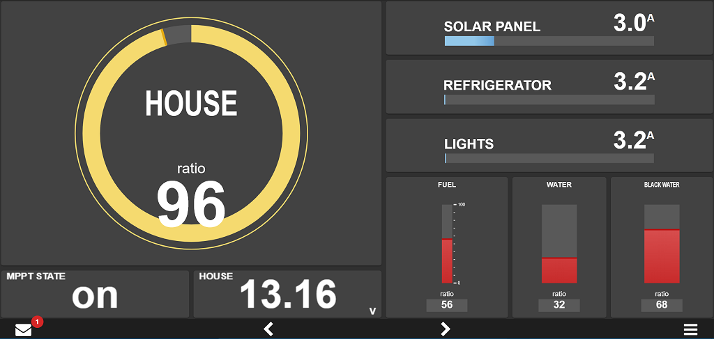
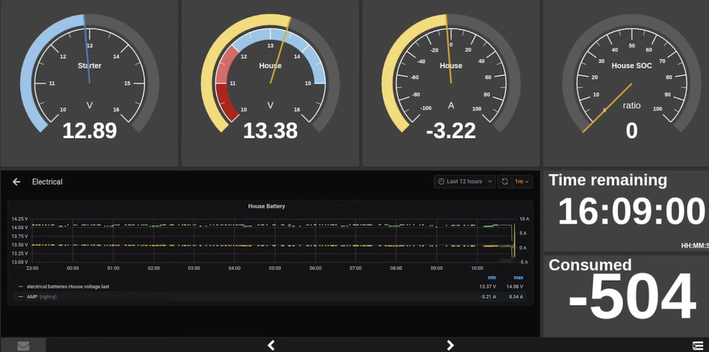

# About KIP

KIP is powerfull marine instrumentation package to display Signal K data. KIP, much like modern expensive MFDs, is very flexible and can be split up in any arrangements and display all kinds of data available to Signal K server.

# Design Goal

The idea is to replicate the functionality of MFDs such as the B&G Triton, Raymarine i70, or Garmin GMI20.
- Display should be fullscreen and not require any scrolling
- Anything displayed should be as big as possible in the given space
- Touchscreen user experience should be excellent
- Layout and configuration should be both easy to operate and flexible
- Phones, tablets, computers and other device and form factors should render well 
- Include support for latest Chromium and other modern browsers

# Features
## Access from Phones, Tablets and Computers
  Simply navigate to http://<Signal K Server URL>:<Signal K Server port>/@mxtommy/kip to load KIP and enjoy it's features remotly on any device.

## Multiple User Profiles
  KIP supports user based configuration profiles (pages, layouts, widget configuration, etc.). The use of profiles offers configuration arrangements by user or to target specific usecase and form factors. 

## User Experience
### Built-in Theme Sample
  Request a theme and send us inspirational/reference material (web sites, picture, etc.). If we fall in love, we will do it. Even better, branch and contribute. We will assist and guide!

  Modern Dark Theme
  
  
  Signal K Inspired Theme
  
  
  Light Blue Theme
  

### Accessible Night Mode
  Keep your night vision with a quick Night Mode access button, regardless of the selected theme. The below image looks very dark, but at night...it's perfect!

  

## Gauge Layout and Configuration
### Flexible and Easy
  Built purposeful screen(s) with however many auges or display widgets you want, where you want them. 

  Split or delete gauge zones, resize and position, then simply add the gauge of your choosing. Add as many pages as you whish to keep screens purposeful.
  
  
  Easy basic gauge and widget configuratio.
   
  
  See what Signal K has to offer that you can leverage in a gauge. Select it and tweak the display options for your purpose.
  
  
  Many units are supported. Choose your prefered App defaults, than tweak it gauge-by-gauge as necessary. Kip will convert the displayed units for you.
   

### Reusable Gauge and Widget Library
  All Kip Gauges and Widgets are visual presentation controls that are very versatile with multiple configuration options available to suit your needs:
  - Text display: Create gauges to display any textual data sent by your system - MPPT state, Timezone date and time, Next Waypoint, Fusion radio song information, noon and sun phases, any system components configuration detail or statues available, etc.
  - Numeric display: Create gauges to display any numerical data sent by your system - SOG, Depth, Winds Speed, VMG, refrigerator temperature, weather data, etc.
  - Wind gauge: Your typical sailboat wind gauge
  - Autopilot: Operate your autopilot from any device remotely 
  - Linear gauge: Visually display any numerical data on a vertically or horizontally scale - Tank and reservoir levels, battery voltage, etc.
  - Linear electrical gauge: A visual display for electrical numerical data - chargers, MPPT, shunt, etc.
  - Radial gauge: Visually display any numerical data on a radial scale - heading, compass, Speed, etc.
  - Radial and linear Steel gauge: Old school look & fell gauges
  - Button and Switch control: Operate remote devices - light switches, bildge pump, solenoid, any Signal K device that support boolean PUT operations
  - Date value: a timezone aware, rich format date/time display 
  - Race Timer: Track regatta start sequence
  - Historical datagram chart: Display numerical data over time on a chart
  - Embedded Webpage: A powerful way of embedding any web based content or application accessible as a URL within an onscreen widget to integrate with your gauges and layout - Grafana dashboards, Node-RED dashboard, internet weather services, Youtube, Netflix, Twitter, Gmail, your own standalone webapp, you name it!

  Get the latest version of Kip to see what's new!

  Gauge types sample
  
  
  Electrical and Tank monitoring sample 
  

  Grafana Embedded Webpage sample 
  

## Share Configuration And Access From Anywhere
  Configure once and seamlessly share the layout and configuration on multiple devices and browsers (computer, phones, tablets,
  Raspberry Pi, etc.) by pointing to a single Signal K server URL address from anywhere.

# Developing

Kip is built on Angular using various open-source assets. All free!

**Tools**

Linux, Macs, Pi or Windows dev platform supported
1. Install the latest Node version
2. Download your favorite coding IDE (we use the free Visual Code)
3. Create your own GitHub KIP fork.
4. Configure your IDE's source control to point to this fork (With Visual Code, GitHub support is built-in) and get the latest Master branch locally.

**Setup**
1. From your fork's Master branch, create working branch with a name such as: New-Widget-abc or fix-issue-abc, etc.
2. Checkout this new Branch to get the source code locally.
3. In a command shell (or in the Visual Code Terminal window), go to the root of you local project folder.
4. Install project dependencies using NPM package and dependency manager: run `npm install`. NPM will read local Kip project dependencies (see Steps 2), download and install everything automatically for you.
5. Build the app locally using Angular-CLI: from that same project root folder, run `ng build`. CLI tool will read local Kip project configuration and set the base href(see Tools - steps 4) and build everything.

**Work**
1. Fire up your local dev instance with CLI using `ng serve --configuration=dev --serve-path=/` to enable the debugger map file loading.
2. Hit Run/Start Debugging in Visual Code or point your favorite browser to `http://localhost:4200/` and voila!

*As you work on source code and save files, the app will automatically reload in the browser with your latest changes.*

**Publish**
1. Once done with your work, from your fork's working Branch, make a GitHub pull request to have your code reviewed, merged and part of the next release. 

Or

2. Build your own production version:
  1. Build: In a terminal from you project folder, use `ng build --configuration=production` to generate a production build.
  2. Have fun! 

**Collaborate**
Join us on Slack -> Signalk-dev / Apps_and_client channel. We will hook up and assist as best we can.

# Feature Ideas
 * Improved Metadata configuration
 * Improved Zones support and alerting
 * AIS Widget
 * GPS information Widget
 * Attitude Indicator Widget
 * Sailing Polars with ChartJS Radar type chart?
 * More Customization options for radial/linear Gauges
 * Pre-created widgets for commonly used displays
