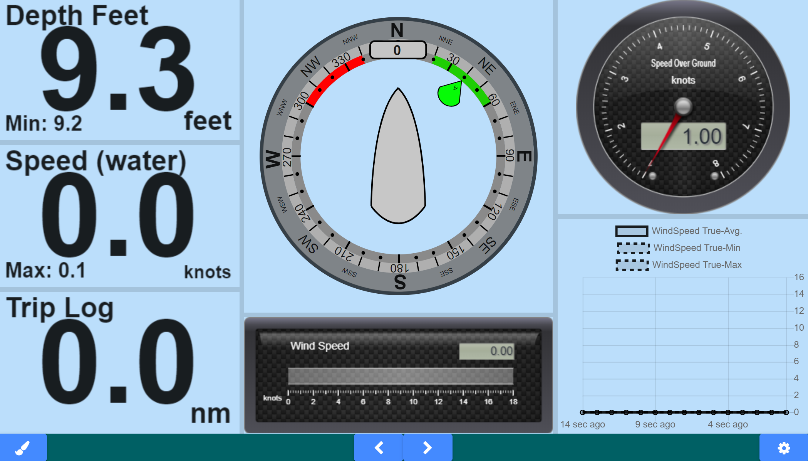
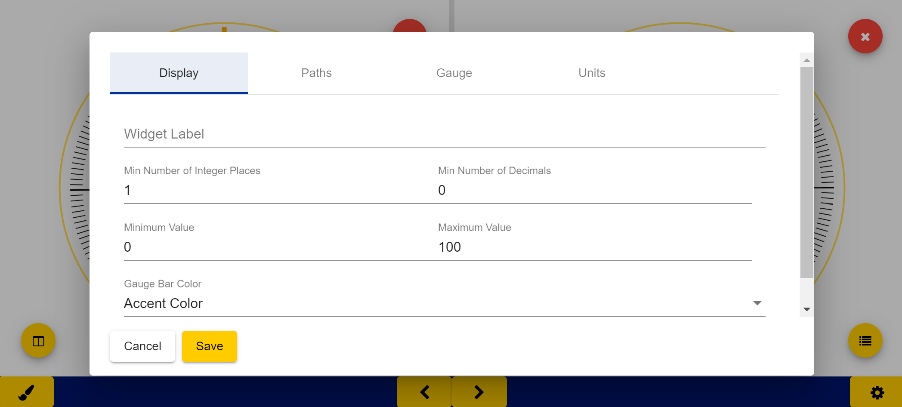

# Kip

This is a marine instrumentation package to display signalK data. Display can be split up in any arrangement to show any kind data available on the server. 

## Design Goal

The idea is to replicate the functionality of your average MFD such as the B&G Triton, Raymarine i70, or Garmin GMI20.
- Display should be fullscreen and not require any scrolling
- Anything displayed should be as big as possible in the given space
- Touchscreen user experience should be excellent
- Layout and configuration should be both easy to operate and flexible
- Compatibility with Chromium browser and other device form factor improtant (**HELP WANTED)  

## Sample Layouts

## Developing

The app is an Angular-cli app. Install dependencies with `npm install`. Then run `ng serve` for a dev server. Navigate to `http://localhost:4200/`. The app will automatically reload if you change any of the source files. Run `ng build` to build the project. The build artifacts will be stored in the `public/` directory. Use the `-prod` flag for a production build. To prepare for npm, run `npm run-script build-npm`.

## Roadmap

### V0.2
* Customization options for Historical Charts
* Attitude Indicator * In progress

### V0.3
 * Sailing Polars with ChartJS Radar type chart?
 * More Customization options for radial/linear Gauges
    * Gauge Zones
 
 * Overview page to quickly scroll through known path info.
 * Alerts/Notifications
 
### Feature Ideas
 * Get historical from server.
 * Pre-created widgets for commonly used displays

 
