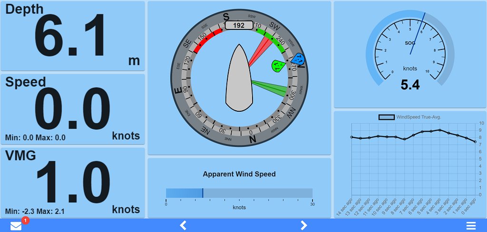
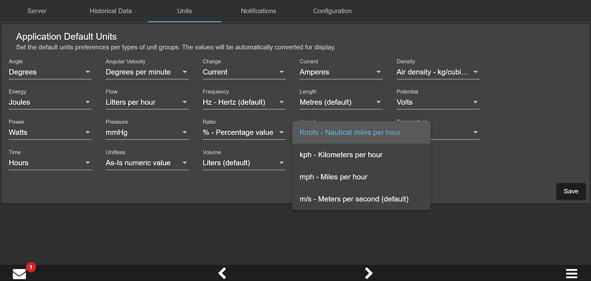

# About KIP

KIP is powerful marine instrumentation package to display Signal K data. KIP, much like modern expensive MFDs, is very flexible and can be split up in any arrangements and display all kinds of data available to Signal K server.

# Design Goal

The idea is to replicate the functionality of MFDs such as the B&G Triton, Raymarine i70, or Garmin GMI20.
- Display should use the entire screen and not require any scrolling
- Anything displayed should be as big as possible in the given space
- Touchscreen user experience should be excellent
- Layout and configuration should be both easy to operate and flexible
- Phones, tablets, computers and other device and form factors should render well 
- Include support for latest Chromium and other modern browsers

# Features
## Access from Phones, Tablets, Raspberry Pi and Computers
  Simply navigate to `http://<Signal K Server URL>:<port>/@mxtommy/kip` to load KIP and enjoy it's features remotely on any device.

### Responsive Design
  KIP adjusts to the device type and form factor for the best possible user experience.

### Touch Devices
- Swipe left and right to cycle trough your Widget layouts.
- Double tap to toggle night mode.

### KIP Mobille App
Run KIP in full screen, with no browser controls visible, just like regular mobile apps. This feature is supported on most mobile OS. Each browser has it's own way of handling PWA deployments.

To install KIP as an App, first load KIP in the browser. Then follow the steps below:

**iOS**
1. Press the "Share" button
2. Select "Add to Home Screen" from the action popup list
3. Tap "Add" in the top right corner to finish installation.
KIP is now installed and available on your home screen

**Android**
1. Press the "three dot" icon in the upper right to open the menu
2. Select "Add to Home screen"
3. Press the "Add" button in the popup
KIP is now installed and available on your home screen

## Multiple User Profiles
  If you have different roles on board; captain, skipper, tactician, navigator, engineers or simply different people with different needs, each can tailor as they wish. The use of profiles can also offer the ability to tie specific configuration arrangements to use case or device form factors.

## User Experience

### Night Mode
  Keep your night vision with a simple double tap. The below image looks very dark, but at night...it's perfect!

  

### Built-in Themes
  Apply your favorite style from the built-in themes gallery.

  Modern Dark Theme
  

  Signal K Inspired Theme
  

  Light Blue Theme
  

  NOTE: Request a new theme by sending us inspirational/reference material (web sites, picture, etc.).
  If we fall in love, we will do it. Even better, branch and contribute yourself. We will assist and guide!

## Page Layouts and Configuration
### Flexible and Easy
  Meant to build purposeful screen(s) with however many widgets you want, where you want them. 

  Quickly split pages into multiple areas, resize and aligne to your liking, add the widget of your choosing to each area. Need more? Add as many additional pages as you whish to keep your display purposeful. Simply swipe left and right or use the bottom page navigation button to quickly cycle from page to page.
  
  
  Easy basic widget configuration.
   
  
  See what Signal K has to offer that you can leverage with widgets. Select it and tweak the display options your your purpose.
  
  
  Many units are supported. Choose your preferred App defaults, than tweak it widget-by-widget as necessary. KIP will automatically convert the units for you.
   

### Reusable Widget Library
  All KIP Widgets are visual presentation controls that are very versatile with multiple advanced configuration options available to suit your needs:
  - Text display: Create gauges to display any textual data sent by your system - MPPT state, vessel details,Next Waypoint, Fusion radio song information, noon and sun phases, any system components configuration detail or statues available, etc.
  - Numeric display: Create gauges to display any numerical data sent by your system - SOG, Depth, Winds Speed, VMG, refrigerator temperature, weather data, etc.
  - Wind gauge: Your typical sailboat wind gauge
  - Autopilot: Operate your autopilot from any device remotely 
  - Linear gauge: Visually display any numerical data on a vertically or horizontally scale - Tank and reservoir levels, battery remaining capacity, etc.
  - Linear electrical gauge: A visual display for electrical numerical data - chargers, MPPT, shunt, etc.
  - Radial gauge: Visually display any numerical data on a radial scale - heading, compass, Speed, etc.
  - Radial and linear Steel gauge: Old school look & fell gauges
  - Button and Switch control: Operate remote devices - light switches, bilge pump, solenoid, any Signal K path that support boolean PUT operations
  - Date display: a timezone aware control with flexible presentation formatting support 
  - Race Timer: Track regatta start sequence
  - Historical datagram chart: Display numerical data over time on a chart
  - Embedded Webpage: A powerful way of integrating any web based content or application within with your KIP layout - Grafana dashboards, Node-RED dashboard, internet weather services, Youtube, Netflix, Twitter, Gmail, your own standalone webapp, you name it!

  Get the latest version of KIP to see what's new!

  Widget Types Sample
  
  
  Electrical and Tank Monitoring Sample 
  

  Grafana Embedded Webpage sample 
  

  ### Harness The Power Of Data State Notifications
  Stay informed with notifications about the state of the data you are interested in.
  As an example, KIP will notify you (inform, warn, alert) when a water depth or temperature sensors reaches certain levels. In addition to KIP's centralized basic visual and audio notification feature, each Widget offers a tailored visual representation appropriate
  to their design objectives providing an optimal user experience.

# How To Contribute

KIP is under MIT license and is built with Nodes and Angular using various open-source assets. All free!

**Tools**

Linux, Mac, Pi or Windows dev platform supported
1. Install the latest Node version (v16+, v18 recommended)
2. Download your favorite coding IDE (we use the free Visual Code)
3. Create your own GitHub KIP fork.
4. Configure your IDE's source control to point to your forked KIP instance (With Visual Code, GitHub support is built-in) and get the fork's Master branch locally.

**Coding**
1. From your fork's Master branch, create working branch with a name such as: New-Widget-abc or fix-issue-abc, etc.
2. Checkout this new Branch.
3. In a command shell (or in the Visual Code Terminal window), go to the root of you local project branch folder, if not done automatically by your IDE.
4. Install project dependencies using NPM package and dependency manager: run `npm install`. NPM will read Kip project dependencies (see Steps 2), download and install everything automatically for you.
5. Build the app locally using Angular-CLI: from that same project root folder, run `ng build`. CLI tool will  build KIP.

**Setup**
1. Fire up your local dev instance with `npm run dev`.
2. Hit Run/Start Debugging in Visual Code or point your favorite browser to `http://localhost:4200/@mxtommy/kip`
3. Voila!

*As you work on source code and save files, the app will automatically reload in the browser with your latest changes.*
*You also need a running Signal K server for KIP to connect to and receive data.*

**Apple PWA Icon Generation**
Use the following tool and command line: npx pwa-asset-generator ./src/svg-templates/KIP-icon.svg ./src/assets/ -i ./src/index.html -m ./src/manifest.json -b "linear-gradient(to bottom, rgba(255,255,255,0.15) 0%, rgba(0,0,0,0.15) 100%), radial-gradient(at top center, rgba(255,255,255,0.40) 0%, rgba(0,0,0,0.40) 120%) #989898" -p 5%

**Share**
Once done with your work, from your fork's working branch, make a GitHub pull request to have your code reviewed, merged and part of the next release.

**Communication and Collaboration**
Join us on Slack -> Signalk-dev / Kip channel. We will hook up and assist as best we can.

# Support
KIP has it's own Discord Signal K channel to get in touch. Join us at https://discord.gg/AMDYT2DQga

# Feature Ideas
 * AIS Widget - Help Wanted
 * Light indicator Widget for Boolean paths
 * Fuel Consumption Widget
 * GPS information Widget - Help Wanted
 * Improve Metadate/Zones support
 * Add a KIP Widget CLI Schematic to automate new Widget creation and facilitate app contributions
 * Improved error logging
 * Retire outdated SteelGauges
 * Upgrade notifications and navigation API to new Signal K Specifications
 * Attitude Indicator Widget - Help Wanted
 * Sailing Polars Widget - Help Wanted
 * More customization options for radial/linear Gauges
 * Pre-created Widgets for commonly used displays
