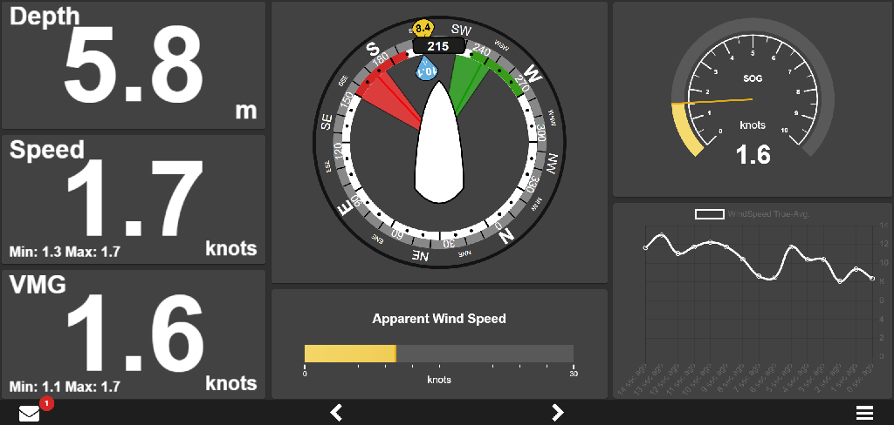
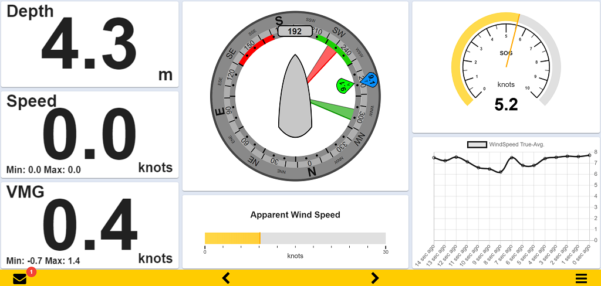
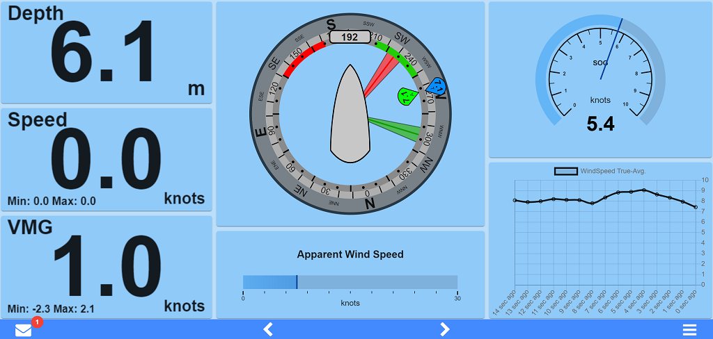
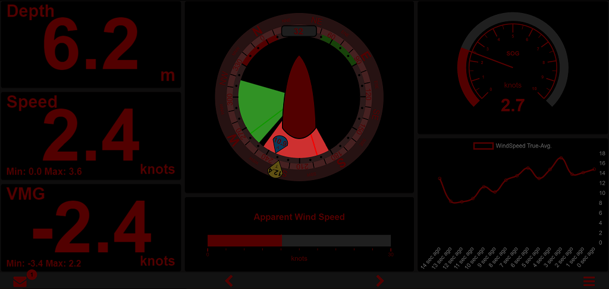
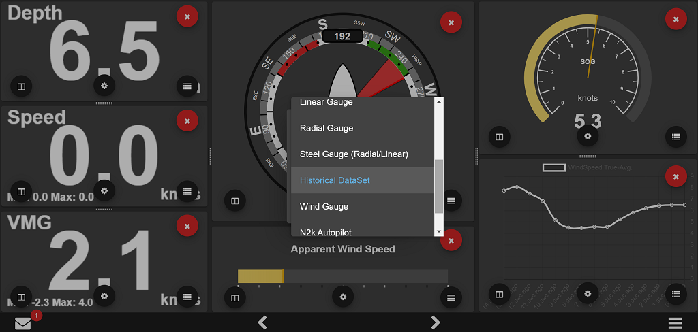
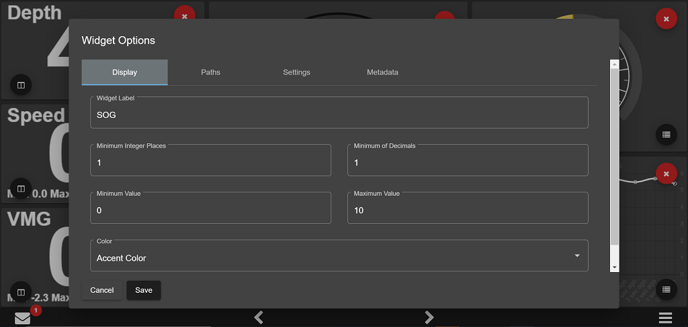
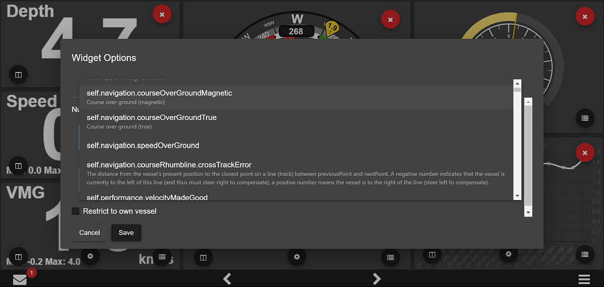
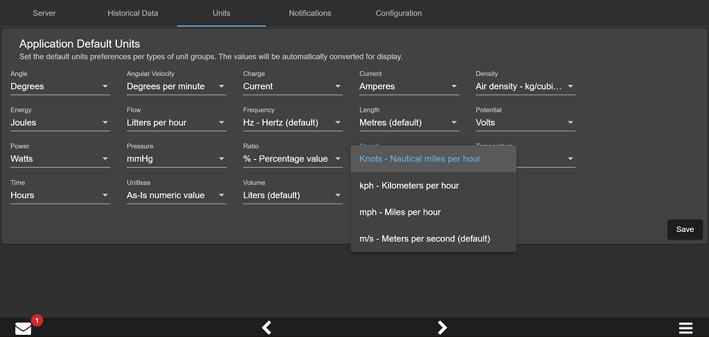
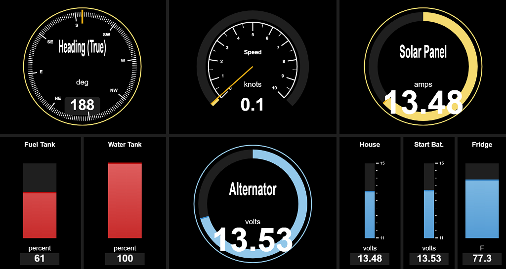

# Kip 

This is a marine instrumentation package to display signalK data. Display can be split up in any arrangement to show any kind data available on the server.

# Design Goal

The idea is to replicate the functionality of your average MFD such as the B&G Triton, Raymarine i70, or Garmin GMI20.
- Display should be fullscreen and not require any scrolling
- Anything displayed should be as big as possible in the given space
- Touchscreen user experience should be excellent
- Layout and configuration should be both easy to operate and flexible
- Compatibility with Chromium browser and other device form factor important (**HELP WANTED)  

# Features
## User Experience
### Built-in Theme Sample
  Request a theme and send us inspirational/reference material (web sites, picture, etc.). If we fall in love, we will do it. Even better, branch and contribute. We will assist and guide!

  Modern Dark Theme
  
  
  SignalK Inspired Theme
  
  
  Light Blue Theme
  

### Accessible Night Mode
  Keep your night vision with a quick Night Mode access button, regardless of the selected theme. The below image looks very dark, but at night...it's perfect!

  

## Gauge Layout and Configuration
### Flexible and Easy
  Built purposeful screen(s) with however many gauges you want, where you want them. 

  Split or delete gauge zones, resize and position, then simply add the gauge of your choosing. Add as many pages as you whish to keep screens purposeful.
  
  
  Easy basic gauge config.
   
  
  See what SignalK has to offer that you can leverage in a gauge. Select it and tweak the display options for your purpose.
  
  
  Many units are supported. Choose your prefered App defaults, than tweak it gauge by gauge as necessary. Kip will convert the displayed units for you.
   

### Reusable Gauge Library
  Get the latest version of Kip to see what's new!

  Sample gauge types
  
  
  Electrical and Tank monitoring sample 
  

# Developing

Kip is built on Angular using various open-source assets. All free!

**Tools**

Linux, Macs, Pi or Windows dev platform supported
1. Install the latest Node version
2. Download you favorite coding IDE (we use the free Visual Code)
3. Create your own GitHub Kip fork and configure your IDE source control to point to this Fork (With Visual Code, GitHub support is built-in)

**Setup**
1. Create a GitHub Branch of your own Kip Fork
2. Checkout this new Branch to get the source code locally.
3. In a command shell (or in the Visual Code Terminal window), go to the root of you local project folder.
4. Install project dependencies using NPM package and dependency manager: run `npm install`. NPM will read local Kip project dependencies (see Steps 2), download and install everything automatically for you.
5. Build the app locally using Angular-CLI: from that same project root folder, run `ng build`. CLI tool will read local Kip project configuration (see Tools - steps 4) and build everything.

**Work**
1. Fire up your local dev instance with CLI using `ng serve --configuration=dev`.
2. Point your favorite browser to `http://localhost:4200/` and voila!

*As you work on source code and save files, the app will automatically reload in the browser with your latest changes.*

**Publish**
1. From your Fork's working Branch, make a GitHub pull request to have your code reviewed, merged and part of the next release. 

Or

2. Build your own version:
  1. Use the `-prod` flag for a production build.
  2. To generate a npm package, run `npm run-script build-npm`.
  3. Warning: Git Bash seems to mess up Base Href, fix it in public/index.html if needed
  4. Deploy and have fun! 

**Collaborate**
Join us on Slack -> SignalK-dev / Apps_and_client channel. We will hook up and assist as best we can.

# Feature Ideas
 * More Customization options for Historical Charts
 * Attitude Indicator
 * Sailing Polars with ChartJS Radar type chart?
 * More Customization options for radial/linear Gauges
 * Pre-created widgets for commonly used displays
