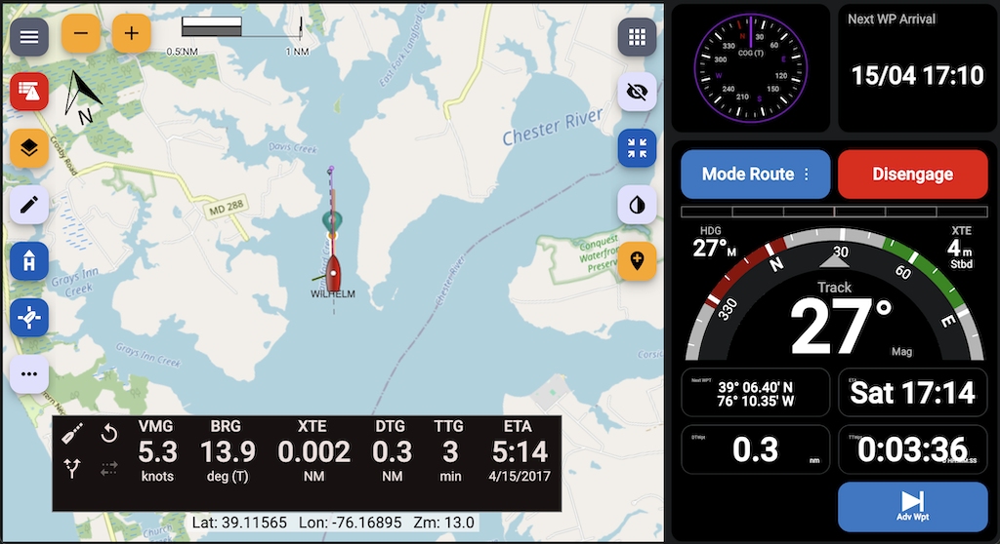
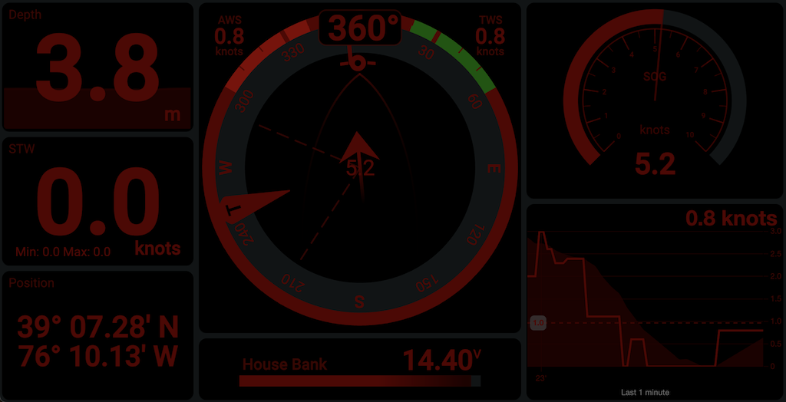

# About KIP

KIP is a powerful and versatile marine instrumentation package designed to display Signal K data. It replicates the functionality of modern Multi-Function Displays (MFDs) similar to most commercial products, while offering unmatched flexibility and customization. KIP can be tailored to any arrangement, displaying all kinds of data available from the Signal K server.

With its responsive design, KIP works seamlessly across phones, tablets, Raspberry Pi, and computers, ensuring an optimal user experience on any device. It supports touchscreen gestures, night/day modes, and even Progressive Web App (PWA) functionality for a full-screen, app-like experience.

Key features include:
- **Flexible Layouts**: Build purposeful dashboards with an easy-to-use and intuitive grid layout system. Drag widgets into place and make adjustments with simple gestures or clicks.
- **Reusable Widget Library**: A wide range of widgets for numerical, textual, and graphical data, as well as advanced controls like switches, sliders, and autopilot operation.
- **Night Mode**: Preserve night vision with a simple tap or automatic switching based on sunrise/sunset.
- **Data State Notifications**: Stay informed with visual and audio alerts for critical data thresholds.
- **Multiple User Profiles**: Tailor configurations for different roles, devices, or use cases.
- **Cross-Device Compatibility**: Access KIP remotely on any device by navigating to `http://<Signal K Server URL>:<port>/@mxtommy/kip`.

KIP is open-source under the MIT license, built by the community and 100% free. Join the community on Discord or contribute to the project on GitHub!

## Read the Help introduction How-to
Read the [Introduction](https://github.com/mxtommy/Kip/blob/master/src/assets/help-docs/welcome.md) help file.

# Design Goal

The goal is to replicate and enhance the functionality of modern marine instrumentation displays while providing unmatched customization and flexibility. The design principles include:

- **Full-Screen Utilization**: Ensure the display uses the entire screen without requiring scrolling, maximizing visibility and usability.
- **Optimized for Readability**: Present data in a large, clear, and easily interpretable format to ensure quick comprehension. Utilize high-contrast color schemes to enhance visibility, especially in bright daylight conditions.
- **Touchscreen Excellence**: Deliver an intuitive and seamless experience for touchscreen users, with support for gestures like swiping and tapping.
- **Cross-Device Compatibility**: Guarantee a consistent and responsive experience across phones, tablets, computers, and other devices.
- **Modern Browser Support**: Include support for the latest versions of Chromium and other modern web browsers to ensure optimal performance and compatibility.

## Features

### Intuitive Controls
- Swipe up and down to navigate through your dashboards effortlessly.
- Swipe left and right to access notifications and other system features quickly.
- Use keyboard shortcuts for essential features, ensuring fast and efficient navigation across devices.

### Progressive Web App (PWA) Support
Run KIP in full-screen mode without browser controls, just like a native mobile app. This feature is supported on most mobile operating systems. Follow your browser's instructions to install KIP as a PWA for quick and easy access. It's usually just a few clicks, such as "Add to Home Screen".

### Flexible Dashboard Layouts
- Effortlessly create and customize dashboards using an intuitive grid layout system.
- Add, resize, and align widgets to design tailored displays for your specific needs.
- Duplicate widgets or entire dashboards, including their configurations, with a single click.
- Organize and reorder dashboards by adding names and arranging them to suit your workflow.
- Seamlessly switch between multiple dashboards for different roles, devices, or use cases.

### Multiple User Profiles
Create and manage profiles for different roles, devices, or use cases. Each profile can have its own dashboard configurations and settings.

### Open Source and Community-Driven
KIP is built with modern web technologies and is open-source under the MIT license. Like many others, join the community on Discord or contribute to the project on GitHub to help shape its future.

## User Experience

### Flexible and Easy
Meant to build purposeful screens with however many widgets you want, wherever you want them.

Add, resize, and position the widgets of your choosing. Need more? Add as many additional dashboards as you wish to keep your display purposeful. Simply swipe up and down to quickly cycle through dashboards.

Intuitive widget configuration.

See what Signal K has to offer that you can leverage with widgets. Select it and tweak the display options to suit your purpose.

Many units are supported. Choose your preferred app defaults, then tweak them widget-by-widget as necessary. KIP will automatically convert the units for you.

## Reusable Widget Library
All KIP widgets are visual presentation controls that are very versatile, with multiple advanced configuration options available to suit your needs:
- **Numeric display**: Create gauges to display any numerical data sent by your system: SOG, depth, wind speed, VMG, refrigerator temperature, weather data, etc.
- **Text display**: Create gauges to display any textual data sent by your system: MPPT state, vessel details, next waypoint, Fusion radio song information, noon and sun phases, any system component configuration detail or status available, etc.
- **Label**: A static text widget.
- **Date display**: A timezone-aware control with flexible presentation formatting support.
- **Position display**: Position coordinates in textual format.
- **Boolean Control Panel**: A switchboard to configure and operate remote devices: light switches, bilge pumps, solenoids, or any Signal K path that supports boolean PUT operations.
- **Slider**: A versatile control that allows users to adjust values within a defined range by sliding. Commonly used for settings like light intensity, volume control, or any parameter requiring fine-tuned adjustments.
- **Simple Linear gauge**: A visual display for electrical numerical data: chargers, MPPT, shunt, etc.
- **Linear gauge**: Visually display any numerical data on a vertical or horizontal scale: tank and reservoir levels, battery remaining capacity, etc.
- **Radial gauge**: Visually display any numerical data on a radial scale: boat speed, wind speed, engine RPM, etc.
- **Compass gauge**: A card or marine compass to display directional data such as heading, bearing to next waypoint, wind angle, etc.
- **Radial and linear Steel gauge**: Old-school look & feel gauges.
- **Pitch & Roll**: Horizon-style attitude indicator showing live pitch and roll for monitoring trim, heel, and sea-state response.
- **Wind Steering Display**: Your typical sailboat wind gauge.
- **Freeboard-SK Chart Plotter**: A high-quality Signal K implementation of the Freeboard integration widget.
- **Autopilot Head**: Operate your autopilot from any device remotely.
- **Data Chart**: Visualize data trends over time.
- **Race Timer**: Track regatta start sequences.
- **Start Line Insight**: Analyze and visualize the start line for tactical racing advantage, including favored end and distance-to-line.
- **Racer Start Timer**: Advanced race countdown timer with OCS (On Course Side) detection and automatic dashboard switching.
- **Embedded Webpage**: A powerful way to display web-based apps published on your Signal K server, such as Grafana and Node-RED dashboards, or your own standalone web app.

Get the latest version of KIP to see what's new!

### Widget Samples
Various

Electrical and Tank Monitoring Sample

Freeboard-SK Integration

Grafana Integration

## Night Mode
Keep your night vision with automatic or manual day and night switching. The image below looks very dark, but at night... it's perfect!

## Harness the Power of Data State Notifications
Stay informed with notifications about the state of the data you are interested in.
For example, Signal K will notify KIP when a water depth or temperature sensor reaches certain levels. In addition to KIP's centralized notification menu, individual widgets offer tailored visual representations appropriate to their design objectives, providing an optimal user experience.

## Multiple User Profiles
If you have different roles on board: captain, skipper, tactician, navigator, engineer—or simply different people with different needs, each can tailor KIP as they wish. The use of profiles also allows you to tie specific configuration arrangements to use cases or device form factors.

## Dedicated Fullscreen instrument display (Kiosk Mode)
Runs KIP on Raspberry Pi as a single application full-screen, suppresses desktop UI and stays on screen like a dedicated instrument display at a fraction of the cost. Read the [Kiosk Mode](https://github.com/mxtommy/Kip/blob/master/src/assets/help-docs/kiosk.md) help file.

## Complementary Components
Typical complementary components you may install (many are often bundled with Signal K distributions):

**Navigation & Charting**
- **Freeboard‑SK** – Multi‑station, web chart plotter dedicated to Signal K: routes, waypoints, charts, alarms, weather layers, and instrument overlays.

**Visual Flow / Automation**
- **Node‑RED** – Low‑code, flow‑based wiring of devices, APIs, online services, and custom logic (alert escalation, device control automation, data enrichment, protocol bridging).

**Data Storage & Analytics**
- **InfluxDB / other TSDB** – High‑resolution historical storage of sensor & performance metrics beyond what lightweight widget charts should retain.
- **Grafana** – Rich exploratory / comparative dashboards, ad‑hoc queries, alert rules on stored metrics, correlation across heterogeneous data sources.

## Complementary Components
Typical complementary components you may install (many are often bundled with Signal K distributions):

**Navigation & Charting**
- **Freeboard‑SK** – Multi‑station, web chart plotter dedicated to Signal K: routes, waypoints, charts, alarms, weather layers, and instrument overlays.

**Visual Flow / Automation**
- **Node‑RED** – Low‑code, flow‑based wiring of devices, APIs, online services, and custom logic (alert escalation, device control automation, data enrichment, protocol bridging).

**Data Storage & Analytics**
- **InfluxDB / other TSDB** – High‑resolution historical storage of sensor & performance metrics beyond what lightweight widget charts should retain.
- **Grafana** – Rich exploratory / comparative dashboards, ad‑hoc queries, alert rules on stored metrics, correlation across heterogeneous data sources.

# Connect, Share, and Support
KIP has its own Discord Signal K channel for getting in touch. Join us at https://discord.gg/AMDYT2DQga

# Features, Ideas, Bugs
See KIP's GitHub project for the latest feature requests:
https://github.com/mxtommy/Kip/issues

# How To Contribute
KIP is under the MIT license and is built with Node and Angular using various open-source assets. All free!

## Project Scope
What KIP IS about:
- Real‑time presentation of vessel & environment data (navigation, performance, systems) pulled from Signal K.
- Fast, legible, touchscreen‑friendly dashboards for underway decision making.
- Configurable widgets (gauges, charts, timers, controls) tuned for sailing operations.

What KIP deliberately IS NOT trying to become:
- A full data lake / long‑term time‑series historian.
- A general purpose automation / rules / orchestration engine.
- A universal external web‑app embedding or mash‑up framework.
- A low‑code integration hub for arbitrarily wiring protocols and services.

Those domains already have excellent, specialized open‑source tools. Instead of re‑implementing them, KIP plays nicely alongside them within a Signal K based onboard stack.

**Processing & Extensions**
- **Signal K Plugins** – Domain‑specific enrichment (polars, performance calculations, derived environmental data, routing aids) published directly into the Signal K data model that KIP can then display.

**Why this separation matters**
Keeping KIP focused preserves responsiveness (lower CPU / memory), reduces UI clutter, and accelerates iteration on core sailing UX. Heavy analytics, complex workflow logic, and broad third‑party embedding stay where they are strongest—outside—but still feed KIP through the common Signal K data fabric.

In short: use KIP to see & act on live sailing information; use the complementary tools to store it long‑term, analyze it deeply, automate decisions, or build advanced integrations.

## Project Scope
What KIP IS about:
- Real‑time presentation of vessel & environment data (navigation, performance, systems) pulled from Signal K.
- Fast, legible, touchscreen‑friendly dashboards for underway decision making.
- Configurable widgets (gauges, charts, timers, controls) tuned for sailing operations.

What KIP deliberately IS NOT trying to become:
- A full data lake / long‑term time‑series historian.
- A general purpose automation / rules / orchestration engine.
- A universal external web‑app embedding or mash‑up framework.
- A low‑code integration hub for arbitrarily wiring protocols and services.

Those domains already have excellent, specialized open‑source tools. Instead of re‑implementing them, KIP plays nicely alongside them within a Signal K based onboard stack.

**Processing & Extensions**
- **Signal K Plugins** – Domain‑specific enrichment (polars, performance calculations, derived environmental data, routing aids) published directly into the Signal K data model that KIP can then display.

**Why this separation matters**
Keeping KIP focused preserves responsiveness (lower CPU / memory), reduces UI clutter, and accelerates iteration on core sailing UX. Heavy analytics, complex workflow logic, and broad third‑party embedding stay where they are strongest—outside—but still feed KIP through the common Signal K data fabric.

In short: use KIP to see & act on live sailing information; use the complementary tools to store it long‑term, analyze it deeply, automate decisions, or build advanced integrations.

**Tools**
Linux, Mac, RPi, or Windows dev platform supported
1. Install the latest Node version (v16+, v18 recommended)
2. Download your favorite coding IDE (we use the free Visual Studio Code)
3. Create your own GitHub KIP fork.
4. Configure your IDE's source control to point to your forked KIP instance (with Visual Studio Code, GitHub support is built-in) and get the fork's master branch locally.
5. Install `npm` and `node`. On macOS, you can use `brew install node` if you have Homebrew.
6. Install the Angular CLI using `npm install -g @angular/cli`

**Coding**
1. From your fork's master branch, create a working branch with a name such as: `new-widget-abc` or `fix-issue-abc`, etc.
2. Check out this new branch.
3. In a command shell (or in the Visual Studio Code Terminal window), go to the root of your local project branch folder, if not done automatically by your IDE.
4. Install project dependencies using the NPM package and dependency manager: run `npm install`. NPM will read the Kip project dependencies, download, and install everything automatically for you.
5. Build the app locally using Angular CLI: from that same project root folder, run `ng build`. The CLI tool will build KIP.

**Setup**
1. Fire up your local dev instance with `npm run dev`.
2. Hit Run/Start Debugging in Visual Studio Code or point your favorite browser to `http://localhost:4200/@mxtommy/kip`. Alternatively, to start the dev server and connect using remote devices such as your phone:  
   `ng serve --configuration=dev --serve-path=/@mxtommy/kip/ --host=<your computer's IP> --port=4200 --disable-host-check`
3. Voila!

*As you work on source code and save files, the app will automatically reload in the browser with your latest changes.*  
*You also need a running Signal K server for KIP to connect to and receive data.*

**Apple PWA Icon Generation**
Use the following tool and command line:  
`npx pwa-asset-generator ./src/assets/favicon.svg ./src/assets/ -i ./src/index.html -m ./src manifest.json -b "linear-gradient(to bottom, rgba(255,255,255,0.15) 0%, rgba(0,0,0,0.15) 100%), radial-gradient(at top center, rgba(255,255,255,0.40) 0%, rgba(0,0,0,0.40) 120%) #989898" -p 5%`

**Share**
Once done with your work, from your fork's working branch, make a GitHub pull request to have your code reviewed, merged, and included in the next release.

## Development Instructions & Guidelines

For comprehensive development guidance, please refer to these instruction files:

### **Primary Instructions:**
- **[COPILOT.md](./COPILOT.md)**: Complete KIP project guidelines including architecture, services, widget development patterns, theming, and Signal K integration.
- **[Angular Instructions](./.github/instructions/angular.instructions.md)**: Modern Angular v20+ coding standards, component patterns, and framework best practices.

### **Performance & SVG Animation**
For guidance on high-performance widget animations (e.g., wind dial rotations, laylines, wind sectors) using requestAnimationFrame outside Angular's change detection, see the new section 12 "SVG Animation Utilities" in [COPILOT.md](./COPILOT.md#12-svg-animation-utilities-requestanimationframe-helpers).

### **Development Workflow:**
1. **Start Here**: Read `COPILOT.md` for KIP-specific architecture and patterns.
2. **Angular Standards**: Follow `.github/instructions/angular.instructions.md` for modern Angular development.
3. **Setup & Build**: Use this README for project setup and build commands.

### **Key Priorities:**
- **Widget Development**: Always extend `BaseWidgetComponent` (see COPILOT.md).
- **Angular Patterns**: Use signals, standalone components, and modern control flow.
- **Theming**: Follow KIP's theme system for consistent UI.
- **Code Quality**: Run `npm run lint` before commits (enforced by Husky).
