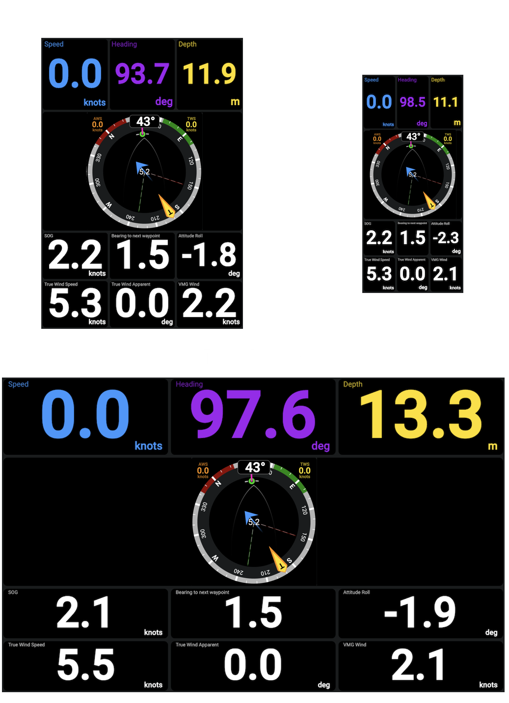
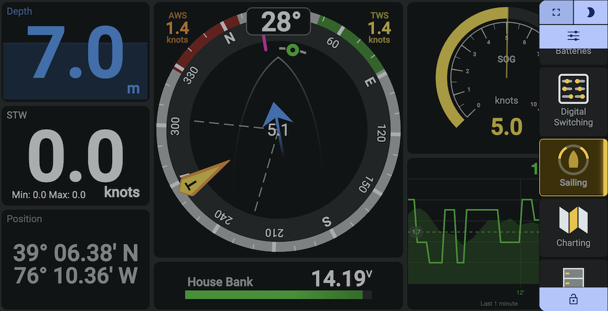
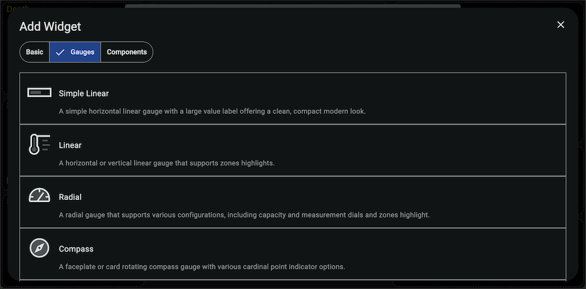
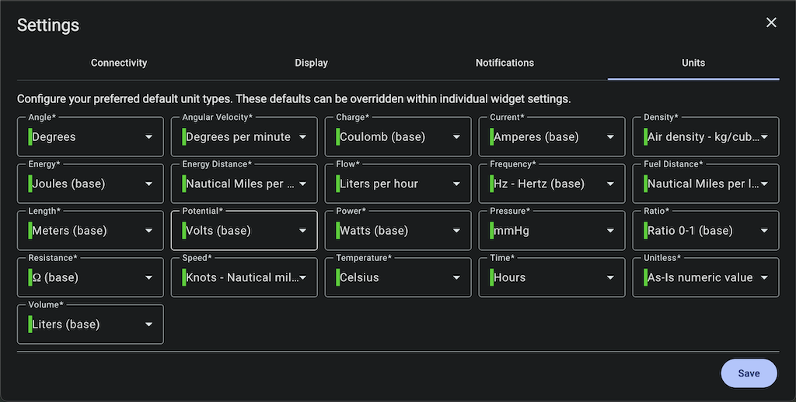
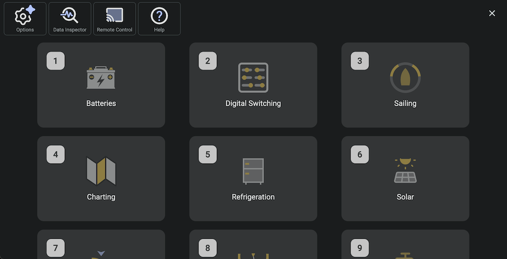
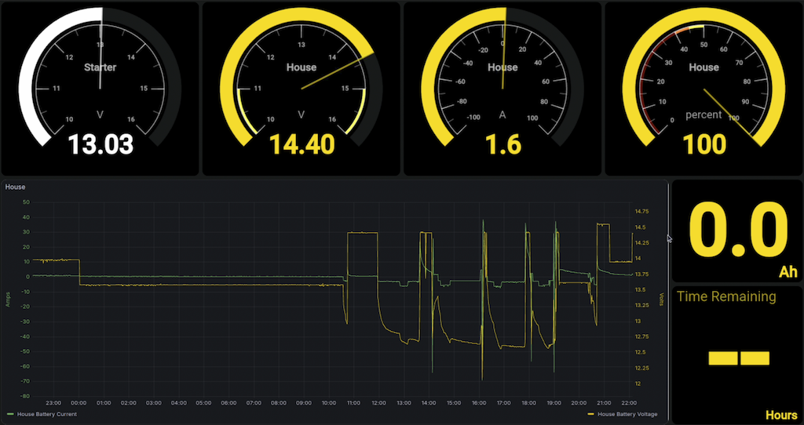

# KIP – Signal K Multi-Function Display (MFD) and Marine Instrument Panel
[](src/assets/help-docs/welcome.md)
[](src/assets/help-docs/community.md)
[](src/assets/help-docs/contact-us.md)

**KIP is the most popular Signal K MFD and marine instrument panel: plug-and-play, touch-optimized, pre-installed, and ready-to-use across all devices.**

Unlike many instrument panels, KIP offers full MFD functionality and is **automatically included with Signal K distributions**, so there’s nothing extra to install or configure. Simply start your [Signal K](https://signalk.org) server, open KIP in a browser, and it’s ready to go. A single instance works everywhere — no per‑device deployment is needed.

KIP is designed for sailors and boaters who want:

- A **ready-to-use, classic marine app experience** with minimal setup.
- A **modern, polished interface** optimized for marine displays.
- **Touch-optimized design**: touch-first, intuitive design for tablets, phones, and other touch-enabled devices.
- **Cross-platform support**: runs on phones, tablets, laptops, Raspberry Pi, Web Enabled TV or other fixed displays - anywhere you can run a web browser.
- **Instant access to all Signal K data**: displays gauges, charts, switches, and other widgets right out of the box.
- **Flexible dashboards**: customize layouts, drag-and-drop widgets, night/day mode, kiosk/fullscreen and remote control support.

With KIP, you get the **familiar feel of professional Multi-Function Displays** combined with the flexibility of Signal K. It’s simple, reliable, and highly usable — the ultimate ready-to-go, modern, touch-first, Multi-Function Display for [Signal K](https://signalk.org) vessels.


## Table of Content
- [Installations Showcase](#installations-showcase)
- [Design Goal](#design-goal)
- [User Experience](#user-experience)
- [Dashboards and Configuration](#dashboards-and-configuration) & [Widget Library](#widget-library)
- [Night Modes](#night-modes)
- [Chartplotter Mode](#chartplotter-mode)
- [Remote Control](#remote-control-other-kip-displays)
- [Kiosk Mode](#dedicated-fullscreen-instrument-display-kiosk-mode)
- [Progressive Web App (PWA)](#progressive-web-app-pwa)
- [Multiple User Configurations](#multiple-user-configurations)
- [How To Contribute](#how-to-contribute) & [Creating Your Own Widgets](#kip-widgets)
- [Connect, Share, and Support](#connect-share-and-support) & [Features, Ideas, Bugs](#features-ideas-bugs)

## Installations Showcase

In addition to the obvious navstation, wall mounted instrument panel and autopilot remote control usecases using PCs, tablets and phones, users have taken KIP into the elements using Raspberry Pi, Pi Zero, rugged tablets and all kinds of low cost AliExpress screens and industry leading, high quality, sunlight readable marine touch screens. KIP's native remote control feature opens up all kinds of possibilities.

## Read the Help Introduction How-To
You just installed KIP and you're stuck; read the [Introduction](https://github.com/mxtommy/Kip/blob/master/src/assets/help-docs/welcome.md) help file.

# Design Goal
The goal is to replicate and enhance the functionality of modern marine instrumentation displays while providing unmatched customization and flexibility. The design principles include:

- **Full-Screen Utilization**: Ensure the display uses the entire screen without requiring scrolling, maximizing visibility, usability reducing onscreen control clutter.
- **Optimized for Readability**: Present data in a large, clear, and easily interpretable format to ensure quick comprehension. Utilize high-contrast color schemes to enhance visibility, especially in bright daylight conditions.
- **Touchscreen Excellence**: Deliver an intuitive and seamless experience for touchscreen users, with support for gestures like swiping and tapping.
- **Cross-Device Compatibility**: Guarantee a consistent and responsive experience across phones, tablets, computers, and other devices.
- **Modern Browser Support**: Include support for the latest versions of Chromium and other modern web browsers to ensure optimal performance and compatibility.



## User Experience

### Interractions
- Swipe up and down to navigate through your dashboards effortlessly.
- Swipe left and right to access notifications and other system features quickly.
- Use keyboard shortcuts for essential features, ensuring fast and efficient navigation across devices types.

### Customyze
- Effortlessly create and customize dashboards using an intuitive grid layout system.
- Add, resize, and align widgets to design tailored displays for your specific needs.
- Duplicate widgets or entire dashboards, including their configurations, with a single click.
- Simply drag dashboards to reorganize them. Double-click any dashboard to open the icon gallery and give each page a unique visual identity.
- Easily switch between multiple user and device configurations profiles for different roles, formfactors or use cases.

Sidenav for quick access to all important features.


Chartplotter Mode with dashboards


## Dashboards and Configuration

### Customizable and Easy
Meant to build purposeful dashboards with however many widgets you want, wherever you want them.

Add, resize, and position the widgets of your choosing. Need more? Add as many additional dashboards as you wish to keep your display purposeful. Simply swipe up and down to quickly cycle through dashboards or effortlessly jump between dashboards with a single tap in the action sidenav, always knowing exactly where you are thanks to clear highlighting of your current dashboard.

Widget lists are sorted by category.


Intuitive widget configuration.


See what Signal K has to offer that you can leverage with widgets. Select it and tweak the display options to suit your purpose.


Many units are supported. Choose your preferred app defaults, then tweak them widget-by-widget as necessary. KIP will automatically convert the units for you.


Organize your dashboards and access tools.


## Widget Library
All KIP widgets are visual presentation controls that are very versatile, with multiple advanced configuration options available to suit your needs:
- **Numeric display**: Create gauges to display any numerical data sent by your system: SOG, depth, wind speed, VMG, refrigerator temperature, weather data, etc.
- **Text display**: Create gauges to display any textual data sent by your system: MPPT state, vessel details, next waypoint, Fusion radio song information, noon and sun phases, any system component configuration detail or status available, etc.
- **Label**: A static text widget.
- **Date display**: A timezone-aware control with flexible presentation formatting support.
- **Position display**: Position coordinates in textual format.
- **Boolean Control Panel**: A switchboard to configure and operate remote devices: light switches, bilge pumps, solenoids, or any Signal K path that supports boolean PUT operations.
- **Slider**: A versatile control that allows users to adjust values within a defined range by sliding. Commonly used for settings like light intensity, volume control, or any parameter requiring fine-tuned adjustments.
- **Simple Linear gauge**: A visual display for electrical numerical data: chargers, MPPT, shunt, etc.
- **Linear gauge**: Visually display any numerical data on a vertical or horizontal scale: tank and reservoir levels, battery remaining capacity, etc.
- **Radial gauge**: Visually display any numerical data on a radial scale: boat speed, wind speed, engine RPM, etc.
- **Compass gauge**: A card or marine compass to display directional data such as heading, bearing to next waypoint, wind angle, etc.
- **Radial and linear Steel gauge**: Old-school look & feel gauges.
- **Level gauge**: Dual-scale heel angle indicator combining a high‑precision ±5° fine level with a wide ±40° coarse arc for fast trim tuning and broader heel / sea‑state monitoring.
- **Pitch & Roll**: Horizon-style attitude indicator showing live pitch and roll for monitoring trim, heel, and sea-state response.
- **Wind Steering Display**: Your typical sailboat wind gauge.
- **Freeboard-SK Chart Plotter**: A high-quality Signal K implementation of the Freeboard integration widget.
- **Autopilot Head**: Operate your autopilot from any device remotely.
- **Data Chart**: Visualize data trends over time.
- **Race Timer**: Track regatta start sequences.
- **Start Line Insight**: Analyze and visualize the start line for tactical racing advantage, including favored end and distance-to-line.
- **Racer Start Timer**: Advanced race countdown timer with OCS (On Course Side) detection and automatic dashboard switching.
- **Embedded Webpage**: A powerful way to display web-based apps published on your Signal K server, such as Grafana and Node-RED dashboards, or your own standalone web app.

Get the latest version of KIP to see what's new!

### Widget Samples
Gauges sample


Various other types of widgets


Freeboard-SK Chartplotter integration with Autopilot widget


Grafana integration with other widgets


## Night Modes
Keep your night vision with automatic or manual day and night switching to a color preserving dim mode or an all Red theme. The images below look very dark, but at night... they are perfect!


## Chartplotter Mode
Keep a live Freeboard‑SK chart visible while switching dashboards for an MFD‑style workflow. The chart persists (no reload or flicker), you can choose its side, collapse it per‑dashboard for full data pages, and drag resize the split. Layout auto‑stacks in portrait / narrow screens. See the dedicated Chartplotter Mode help page for setup, performance tips, and troubleshooting.

## Remote Control Other KIP Displays
Control which dashboard is shown on another KIP instance (e.g., a mast display, hard-to-reach screen, or a non‑touch device) from any KIP, including your phone.

Use cases
- Mast display: change dashboards from the cockpit.
- Wall/helm screens: toggle dashboards without standing up or reaching for controls.
- Non‑touch/no input: select dashboards when no keyboard/mouse is connected or touch is not supported/disabled.

## Dedicated Fullscreen instrument display (Kiosk Mode)
Runs KIP on Raspberry Pi as a single full-screen application, suppresses the desktop UI and stays on screen like a dedicated chartplotter or marine instrument panel at a fraction of the cost. Read the [Kiosk Mode](https://github.com/mxtommy/Kip/blob/master/src/assets/help-docs/kiosk.md) help file.

## Progressive Web App PWA
Run KIP without browser controls, just like a native computer, tablet or phone app. This feature is supported on most mobile operating systems and desktop browser. It freezes up screen real estate and offers a native Android and iOS app experience with single icon launch. Follow your browser's instructions to install Progressiver Web Apps. It's usually just a few clicks, such as "Add to Home Screen".

## Multiple User Configurations
If you have different roles on board: captain, skipper, tactician, navigator, engineer—or simply different people with different needs, each can tailor KIP as they wish. The use of profiles also allows you to tie specific configuration arrangements to use cases or device form factors.

## Complementary Components
Typical complementary components you may install (most are often bundled with Signal K distributions):

**Navigation & Charting**
- **Freeboard‑SK** (pre-installed) – Multi‑station, web chart plotter dedicated to Signal K: routes, waypoints, charts, alarms, weather layers, and instrument overlays.

**Visual Flow / Automation**
- **Node‑RED** – Low‑code, flow‑based wiring of devices, APIs, online services, and custom logic (alert escalation, device control automation, data enrichment, protocol bridging).

**Data Storage & Analytics**
- **InfluxDB / other TSDB** – High‑resolution historical storage of sensor & performance metrics beyond what lightweight widget charts should retain.
- **Grafana** – Rich exploratory / comparative dashboards, ad‑hoc queries, alert rules on stored metrics, correlation across heterogeneous data sources.

## Harness the Power of Data State Notifications
Stay informed with notifications about the state of the data you are interested in.
For example, Signal K will notify KIP when a water depth or temperature sensor reaches certain levels. In addition to KIP's centralized notification menu, individual widgets offer tailored visual representations appropriate to their design objectives, providing an optimal user experience.

# How To Contribute
KIP is under the MIT license and is built with Node and Angular using various open-source assets. All free!

## Project Scope
What KIP IS about:
- Real‑time presentation of vessel & environment data (navigation, performance, systems) pulled from Signal K.
- Fast, legible, touchscreen‑friendly dashboards for underway decision making.
- Configurable widgets (gauges, charts, timers, controls) tuned for sailing operations.

What KIP deliberately IS NOT trying to become:
- A full data lake / long‑term time‑series historian.
- A general purpose automation / rules / orchestration engine.
- A universal external web‑app embedding or mash‑up framework.
- A low‑code integration hub for arbitrarily wiring protocols and services.

Those domains already have excellent, specialized open‑source tools. Instead of re‑implementing them, KIP plays nicely alongside them within a Signal K based onboard stack.

### Processing, Extensions and Widgets

#### Signal K Plugins
Domain‑specific enrichment (polars, performance calculations, derived environmental data, routing aids) published directly into the Signal K data model that KIP can then display.

#### KIP Widgets
Visual data representation component that use Signal K path data and API V2 features. Scaffolding a new widgets only takes a few moments and is backed by KIP AI agent instructions providing willed creative minds a personal assistant programmer.

Run one simple command (example):
```
npm run generate:widget
```
or ask your AI to create a widget using the KIP project AI instructions.

For deeper details you can still look at `COPILOT.md`, but you don’t need to in order to get started.

### Why this separation matters

Keeping KIP focused preserves responsiveness (lower CPU / memory), reduces UI clutter, and accelerates core sailing user experience development. Heavy analytics, complex workflow logic, and broad third‑party embedding stay where they are strongest—outside—but still feed KIP through the common Signal K data fabric.

In short: use KIP to see & act on live sailing information; use the complementary tools to store it long‑term, analyze it deeply, automate decisions, or build advanced integrations.

## Getting Started

**Linux, Mac, RPi, or Windows dev platform supported**
1. Download your favorite coding IDE (we use the free Visual Studio Code)
2. Create your own GitHub KIP fork.
3. Configure your IDE's source control to point it to your forked KIP instance (Visual Studio Code, GitHub support is built-in) and get the fork's master branch locally.
4. Install `npm` and `node`. On macOS, you can use `brew install node` if you have Homebrew. See https://nodejs.org/en/download for more options.
5. Install the Angular CLI using `npm install -g @angular/cli`

**Project Setup**
1. From your fork's master branch, create a working branch with a name such as: `new-widget-abc` or `fix-issue-abc`, etc.
2. Check out this new branch.
3. In a command shell (or in the Visual Studio Code Terminal window), go to the root of your local project folder, if not done automatically by your IDE.
4. Install project dependencies using the NPM package and dependency manager: run `npm install`. NPM will read the KIP project dependencies, download, and install everything automatically for you.
5. Build the app locally using Angular CLI: from that same project root folder, run `npm run build:all`. The CLI tool will build KIP.

**Code and Test**
1. Fire up your local KIP development instance with `npm run dev`.
2. Hit Run/Start Debugging in Visual Studio Code or manually point your favorite browser to `http://localhost:4200/@mxtommy/kip`. Alternatively, to start the development server and allow remote devices connections, such as with your phone or RPi (blocked for security reasons by default):  
   `ng serve --configuration=dev --serve-path=/@mxtommy/kip/ --host=<your computer's IP> --port=4200`
3. Voila!

*As you work on source code and save files, the app will automatically reload in the browser with your latest changes.*  
*You will also need a running Signal K server for KIP to connect to and receive data. You could also use https://demo.signalk.org but without authentication enabled, your actions, features and test coverage will be limited.*

**Apple PWA Icon Generation**

Use the following tool and command line:  
`npx pwa-asset-generator ./src/assets/favicon.svg ./src/assets/ -i ./src/index.html -m ./src manifest.json -b "linear-gradient(to bottom, rgba(255,255,255,0.15) 0%, rgba(0,0,0,0.15) 100%), radial-gradient(at top center, rgba(255,255,255,0.40) 0%, rgba(0,0,0,0.40) 120%) #989898" -p 5%`

**Share**

Once done with your work, from your fork's working branch, make a GitHub pull request to have your code reviewed, merged, and included in the next release. It's always optimal to sync with us prior to engaging in extensive new development work.

## Development Instructions & Guidelines Documentation

For comprehensive development guidance, please refer to these instruction files:

### **Primary Instructions:**
- **[COPILOT.md](./COPILOT.md)**: Complete KIP project guidelines including architecture, services, widget development patterns, theming, and Signal K integration.
- **[Angular Instructions](./.github/instructions/angular.instructions.md)**: Modern Angular v20+ coding standards, component patterns, and framework best practices.

### **Development Workflow:**
1. **Start Here**: Read `COPILOT.md` for KIP-specific architecture and patterns.
2. **Angular Standards**: Follow `.github/instructions/angular.instructions.md` for modern Angular development.
3. **Setup & Build**: Use this README for project setup and build commands.

### **Key Priorities:**
- **Widget Development**: Use the Host2 widget pattern (signals + directives) and scaffold new widgets with the `create-host2-widget` schematic (see `COPILOT.md`).
- **Angular Patterns**: Use signals, standalone components, and modern control flow.
- **Theming**: Follow KIP's theme system for consistent UI.
- **Code Quality**: Run `npm run lint` before commits.

KIP is open-source under the MIT license, built by the community and 100% free. [Join the community](https://discord.gg/AMDYT2DQga) on Discord or contribute to the project on GitHub!

# Connect, Share, and Support
KIP has its own Discord Signal K channel for getting in touch. Join us at https://discord.gg/AMDYT2DQga

# Features, Ideas, Bugs
See KIP's GitHub project for the latest feature requests:
https://github.com/mxtommy/Kip/issues
