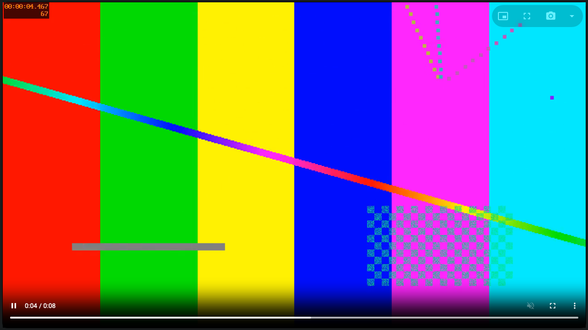
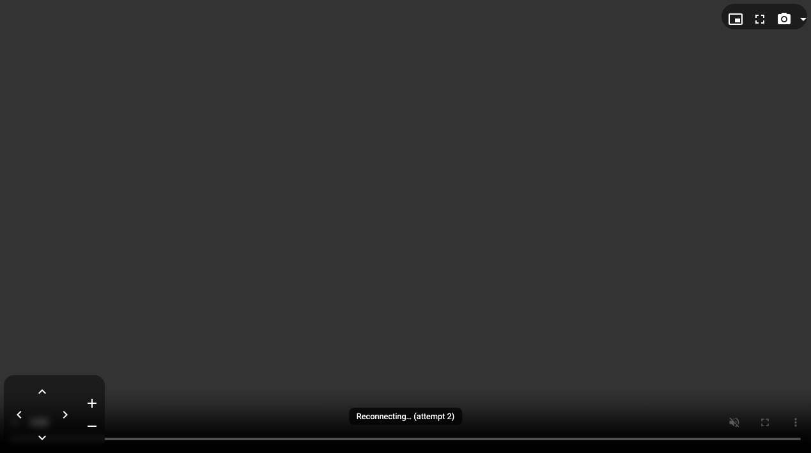
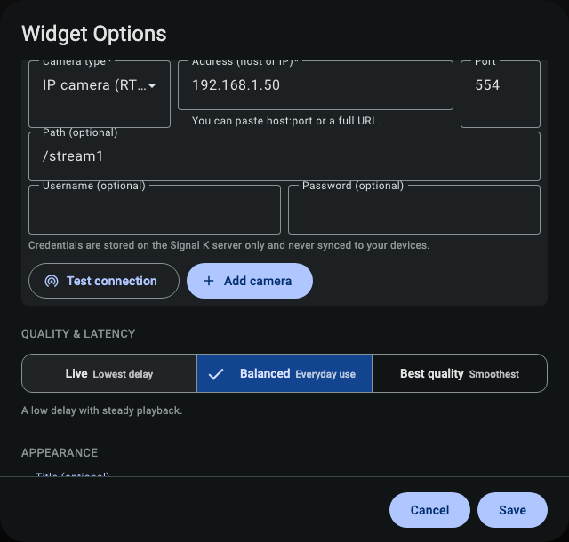
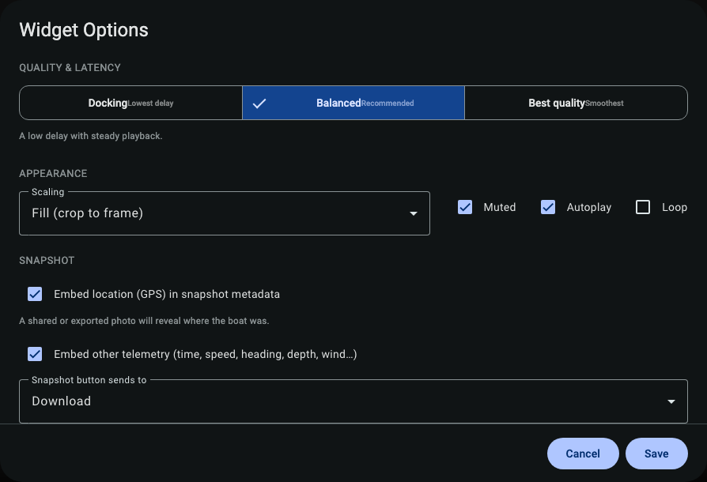
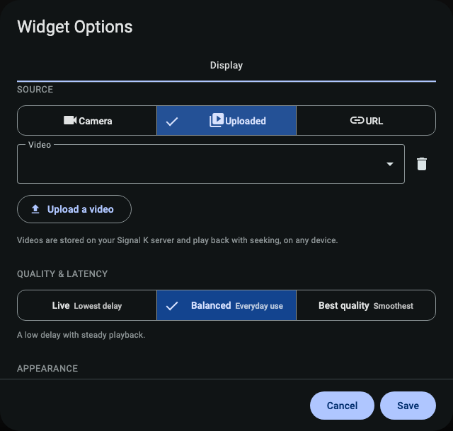

## Video Recipes

Short, step-by-step guides for the most common things people do with the Video widget. Each one
starts from a dashboard in **edit mode** (tap the pencil/unlock to add or change widgets). For the
full reference, see **The Video Widget** help page.

> Recipes that use a **camera** or **uploaded video** need the free **SK Video** add-on installed on
> your boat's Signal K server. Recipes that use a **web address (URL)** work with no add-on.

---

### Watch the foredeck while sailing

**You'll get:** the view from a bow or mast camera, right on a sailing dashboard.

1. Add a **Video** widget to your dashboard.
2. Open its settings and set **Source** to **Camera**.
3. Tap **Scan network**. When your foredeck camera appears, tap it to fill in its details.
   (No camera found? Add it by hand under **Add a camera** — see the recipe below.)
4. If the camera asks for a login, type the **Username** and **Password**.
5. Tap **Add camera**, then leave **Delivery** on **Standard (HLS)**.
6. Set **Quality & Latency** to **Balanced** and save.

**Tip:** Put this widget on its own "Underway" dashboard so it only runs when you're looking at it —
that saves battery and keeps your device cool.

---

### Set up a docking camera with almost no delay

**You'll get:** a near-instant camera view for close-quarters maneuvering, with on-screen steering if
the camera can move.

1. Add a **Video** widget and set **Source** to **Camera**.
2. Pick your stern or dock camera from the list (or scan/add it).
3. Set **Delivery** to **Low latency (WebRTC)**.
4. Set **Quality & Latency** to **Live**.
5. Save. If the camera supports it, the **pan/tilt/zoom** pad appears over the picture.

**Tip:** Press and hold the arrows to move; let go to stop. Use the **bookmark** button to jump to a
saved "looking at the dock" position.

---

### Add a camera by hand

**You'll get:** a working camera even if it doesn't show up in a scan.

1. In the Video widget settings, set **Source** to **Camera**.
2. Under **Add a camera**, fill in:
   - **Name** — for example "Stern".
   - **Stream type** — usually **rtsp**.
   - **Address** — the camera's address on your boat network, like `192.168.1.50`.
   - **Port / Path** — only if your camera's manual says so (many cameras don't need them).
   - **Username / Password** — only if the camera requires a login.
3. Tap **Add camera**. It's saved and selected.

**Tip:** Not sure of the address or path? Check the camera's manual or its phone app — look for the
"RTSP URL". The part after the address (like `/stream1` or `/h264`) is the **Path**.

---

### Save a photo of a hazard — with its GPS position

**You'll get:** a photo of something in the water that quietly remembers exactly where the boat was.

1. While the camera is showing, open the widget settings and the **Snapshot** section.
2. Turn on **Embed location (GPS)** and **Embed other telemetry**. Save.
3. Back on the video, hover (or tap) to show the buttons, and press the **snapshot** button.
4. Use the small arrow beside it to **Download** or **Share** the photo.

> ⚠️ **Privacy:** a photo with location turned on reveals where your boat was when you share or export
> it. Turn **Embed location (GPS)** off if you don't want that.

---

### Show a stream from a web address

**You'll get:** any browser-playable video on your dashboard, with no add-on.

1. Add a **Video** widget and set **Source** to **URL**.
2. Paste the address of a video file (`.mp4`/`.webm`), an HLS stream (`.m3u8`), or an MJPEG feed.
3. Leave **Stream type** on **Auto-detect**. If nothing shows, pick the type by hand.

**Tip:** A regular `rtsp://` IP camera address will **not** work here — use a **Camera** source for
those.

---

### Store a video on the boat and watch it anywhere

**You'll get:** a clip kept on the Signal K server that plays on any device, with a scrub bar.

1. Add a **Video** widget and set **Source** to **Uploaded**.
2. Tap **Upload a video** and choose a file (MP4, WebM or MOV).
3. When it finishes, it's selected automatically. Pick it again any time from the list.

**Tip:** Uploaded videos are shared from the boat's server, so every phone and tablet on board can
play the same clip — no copying files around.

---

### Use one camera on several dashboards

**You'll get:** the same camera in more than one place, set up only once.

1. Add the camera once using any recipe above. It's now a **saved camera**.
2. On another dashboard, add a **Video** widget, set **Source** to **Camera**, and just **pick it from
   the list** — no need to re-enter the address or login.

**Tip:** Saved cameras live on the Signal K server, so they're available to every device on the boat.

---

### Watch several cameras at once

**You'll get:** a "camera wall" view.

1. Add **one Video widget per camera** to the same dashboard.
2. Arrange and size them on the grid however you like.

**Tip:** Each video uses power and warms up the device. On phones and tablets, keep it to a handful at
a time, and let dashboards you're not looking at pause themselves.
