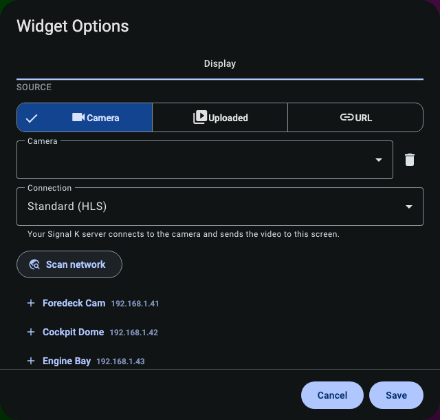
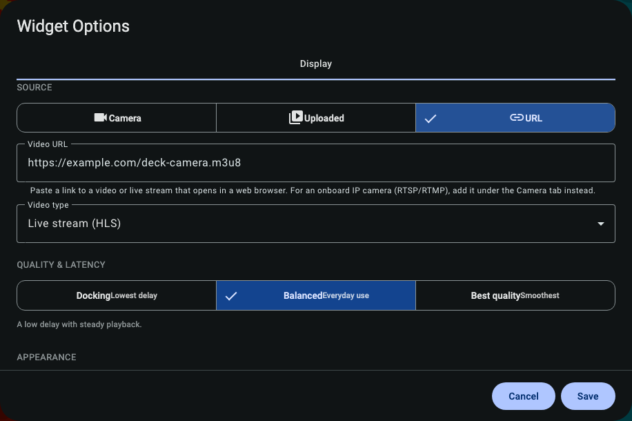

## The Video Widget

The Video widget puts live cameras and saved video clips right on your dashboard. Use it to keep an
eye on the water while docking, watch the foredeck under sail, check the engine room, or look back at
a clip you saved earlier.

There are three kinds of video you can show:

- **A web address (URL)** — a video file or live stream you can paste in. No extra setup.
- **A camera** — an IP camera on the boat (the common kind that speaks "RTSP"). This needs the free
  **SK Video** add-on for your Signal K server (see [Cameras](#cameras-rtsp--ip-cameras) below).
- **An uploaded video** — a clip you store on the boat's Signal K server and play on any device.

---

## Adding a video

Open the widget's settings and look at the **Source** row at the top. Pick the kind of video you
want, then fill in the details that appear.

### Paste a web address (URL)

Choose **URL** and paste the address of a video. The widget plays anything your browser can play on
its own:

- **A video file** — an address ending in `.mp4` or `.webm`.
- **A live HLS stream** — an address ending in `.m3u8`.
- **An MJPEG stream** — a simple "motion JPEG" camera feed.
- **A WebRTC stream** — a very low-delay live feed.

Leave **Stream type** on **Auto-detect** and the widget will usually figure it out. If the picture
doesn't appear, pick the type by hand — MJPEG and WebRTC can't be detected from the address alone.

> **Note:** A web browser can't open `rtsp://` or `rtmp://` addresses — the kind most IP cameras use.
> For those, use a **Camera** source instead (next section).

---

## Cameras (RTSP / IP cameras)

Most onboard cameras speak **RTSP**, which browsers can't play directly. The **SK Video** add-on for
your Signal K server does the translating for you, so KIP can show the picture. Once it's installed,
choose **Camera** under **Source**.

You have three ways to set up a camera:

**1. Pick a saved camera.** Cameras you've already added show up in the **Camera** list. Choose one and
you're done — its login and settings are remembered, so you never type them twice.

**2. Scan for cameras.** Tap **Scan network** and KIP asks your boat's network for cameras that
announce themselves. Found cameras appear in a list; tap one to fill in its details for you.

**3. Add a camera by hand.** Under **Add a camera**, enter:

- **Name** — anything you like, such as "Foredeck" or "Engine Room".
- **Stream type** — usually **rtsp** for an IP camera.
- **Address** — the camera's address on the boat network (for example `192.168.1.50`).
- **Port** and **Path** — only if your camera needs them (check its manual).
- **Username / Password** — only if the camera asks for a login.

Tap **Add camera** and it's saved and selected. **Your camera login is kept on the Signal K server
only — it is never copied onto your phone, tablet, or shared between devices.**

**Delivery** lets you choose how the picture reaches you:

- **Standard (HLS)** — works on every device. A second or two of delay. Good for most uses.
- **Low latency (WebRTC)** — almost no delay. Best for docking and close manoeuvring.

### Move the camera (pan, tilt & zoom)

If your camera can move (this is called **PTZ**), a control pad appears over the picture.

- **Press and hold an arrow** to pan or tilt. Let go to stop.
- **Hold + or −** to zoom in or out.
- Tap the **bookmark** button to jump to a saved position (a "preset").

The camera moves only while you're holding a button, so it can't run away on you.

---

## Uploaded videos

You can also store video files on the boat's Signal K server and play them on any device — handy for
reference clips, a saved chart-briefing, or footage you want to keep. This also needs the **SK Video**
add-on.

Choose **Uploaded** under **Source**, then tap **Upload a video** and pick a file (MP4, WebM or MOV).
It appears in the list to choose from, plays with a scrub bar so you can jump around, and can be
removed with the trash button.

---

## Picture quality vs. delay

Live video always trades **delay** against **smoothness**. Under **Quality & Latency**, pick the
balance you want:

- **Docking** — the least delay, for close-quarters manoeuvring.
- **Balanced** — a small delay with smooth, steady playback. Recommended.
- **Best quality** — the smoothest, sharpest picture, with a bit more delay.

If a live stream drops out, the widget quietly tries again a few times before showing a **Retry**
button. To save battery and keep things cool, video pauses automatically when its dashboard isn't on
screen.

---

## Snapshots

Hover over the video (or tap it on a touch screen) to reveal the buttons in the top-right corner:

- **Picture-in-Picture** — pop the video out into a small floating window.
- **Fullscreen** — fill the screen with the video.
- **Snapshot** — capture the current frame as a photo. The small arrow next to it chooses where the
  photo goes: **Download** it, or **Share** it.

### Saving your position and boat data in a snapshot

A snapshot can quietly tuck your boat's live data into the photo file (this is called EXIF data) —
your **GPS position**, plus heading, speed, depth, wind and the time. It's a great way to mark a
hazard or remember a dock. You control this under **Snapshot** in the settings:

- **Embed location (GPS)** — ⚠️ a photo you share or export will reveal **where the boat was**. Turn
  this off if you don't want that.
- **Embed other telemetry** — the time, speed, heading, depth, wind, and so on.

---

## A few tips

- **On an iPhone or iPad (Safari):** MJPEG streams often show just one frozen frame. For those
  cameras, choose **HLS** or **WebRTC** instead — the widget will warn you when this matters.
- **No picture, just a message?** The widget always tells you what's wrong instead of showing a black
  square — for example "can't reach the camera" or "this stream can't play in this browser." Check the
  address, the camera's login, or try a different **Delivery** option.
- **One widget shows one camera.** To watch several at once, add several Video widgets to your
  dashboard.
