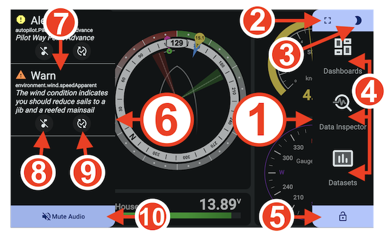

## Touch, Mouse, and Keyboard Navigation
KIP supports multiple input modes for seamless navigation across devices.

| Actions                    | Touch         | Mouse                        | Keyboard Shortcuts                                 |
|----------------------------|--------------|------------------------------|----------------------------------------------------|
| Open Actions sidenav          | Swipe left    | Click, drag left, and release| <kbd>Shift</kbd> + <kbd>Ctrl</kbd> + <kbd>←</kbd> (Left Arrow) |
| Open Notification sidenav     | Swipe right   | Click, drag right, and release| <kbd>Shift</kbd> + <kbd>Ctrl</kbd> + <kbd>→</kbd> (Right Arrow)  |
| Cycle through dashboards   | Swipe up/down | Click, drag up/down, and release| <kbd>Shift</kbd> + <kbd>Ctrl</kbd> + <kbd>↑</kbd>/<kbd>↓</kbd> (Up/Down Arrow) |
| Toggle Fullscreen          | N/A           | N/A                          | <kbd>Shift</kbd> + <kbd>Ctrl</kbd> + <kbd>F</kbd>  |
| Toggle Night mode          | N/A           | N/A                          | <kbd>Shift</kbd> + <kbd>Ctrl</kbd> + <kbd>N</kbd>  |
| Toggle dashboard edit mode | N/A           | N/A                          | <kbd>Shift</kbd> + <kbd>Ctrl</kbd> + <kbd>E</kbd>  |

_Note that the words Touch and Tap are synonymous with mouse click._
 

## General Layout

1. Actions menu
2. *Fullscreen toggle button
3. **Night Mode toggle button
4. Settings button
5. Select dashboard buttons
6. Unlock dashboard edit mode
7. Notifications menu
8. Notification message
9. Silence notification
10. Resolve notification
11. Mute audio toggle button

*Only visible if mode is supported

**Only if visible if automatic day and night is not enabled. See <Home / Settings / Display>.

## Loading KIP on Phones, Tablets, Raspberry Pi, and Computers
Simply navigate to `http://<Signal K Server URL>:<port>/@mxtommy/kip/` to load KIP and enjoy its features remotely on any device.

## Mobile App
Run KIP in full screen, without browser controls, just like a regular mobile app. This feature is supported on most mobile operating systems. Each browser has its own way of handling Progressive Web App (PWA) installations.

**iOS**
1. Press the "Share" button.
2. Select "Add to Home Screen" from the action popup list.
3. Tap "Add" in the top right corner to finish installation.
KIP is now installed and available on your home screen.

**Android**
1. Press the "three dot" icon in the upper right to open the menu.
2. Select "Add to Home screen."
3. Press the "Add" button in the popup.
KIP is now installed and available on your home screen.

## Fullscreen
You can toggle fullscreen mode on and off, and disable the screen saver and computer sleep mode (if supported by the device/browser), by clicking the small Expand/Reduce button in the upper left corner of the Actions menu or using the keyboard hotkey. This button is not available on mobile devices.

## Night Mode
Save your night vision by automatically switching KIP to day or night mode based on sunrise and sunset hours (the Signal K Derived Data plugin is required for automatic switching). This feature can be enabled in the **Settings > Display** page. You can also manually set the mode by clicking the small Moon/Sun button in the upper right corner of the Actions menu. Note that if automatic switching is enabled, brightness will reset to the Signal K mode value.

## Multiple User Profiles and Configuration Sharing
KIP supports multiple user profiles, allowing different roles on board—such as captain, skipper, tactician, navigator, or engineer—to tailor the interface to their needs. Profiles can also be used to tie specific configuration arrangements to use cases or device form factors. See the Login & Configurations help sections for mode details.

## Remote Control Other KIP Displays
Control which dashboard is shown on another KIP instance (e.g., a mast display, hard-to-reach screen, or a non‑touch device).

Use cases
- Mast display: change dashboards from the cockpit.
- Wall/helm screens: toggle dashboards without standing up or reaching for controls.
- Headless/non‑touch: select dashboards when no keyboard/mouse is connected.

Setup
1) On the device you want to control (Target KIP)
- Open Options → Display → Remote Control.
- Enable “Allow this KIP dashboard to be managed remotely.”
- Set an Instance Name (easier to recognize later).

2) On the device you’ll control from (Controller KIP)
- Open the Actions menu, access Settings and choose Remote Control.
- Pick a device from the list (by Instance Name).
- Choose a dashboard tile to set it active on the target device.

Notes and tips
- Both devices must connect to the same Signal K server.
- Permissions: you must use an authenticated connection to Signal K user (Connectivity Login to Server toggle).
- If the device list is empty, verify the Target KIP has “Allow this dashboard to be managed remotely” enabled and a name set.
- Changes are sent instantly; the UI shows the currently active dashboard.
